  

  

 

<b>📄 View Plain Text ASCII / Raw Fastfetch Output</b>

 

<pre>
            .l0WMMMMMN0l.               roumya@swain ----------------------------------------------------
          lNMW0o:;,;:o0WMNl             OS: ......................... Windows 11, Kali Linux, Android
        oMMk'           'kMNc           Uptime: ..................... 21 years, 8 months, 14 days
      .NMx                 oW0.         Host: ....................... Bhubaneswar, Odisha, India
     ,MN.                   .KX'        Kernel: ..................... Security Tool Developer
    .MMK:'                 .;OWX.       IDE: ........................ VS Code, PyCharm, Linux
    XMoOMMWx.           .lKNKxlNO       
   :Mx   .oWMO.       .xWKc.   oW,      Languages.Programming: ...... Python, C, C++, Bash
   KM.      :MM:     ;NX;      .Wx      Languages.Computer: ......... HTML, CSS, Markdown, JSON, YAML
   MN         0Mc   lMx         K0      Languages.Real: ............. English, Hindi, Odia
   MX          oMc cMo          0X      
   MN           ONcNk           KK      Hobbies.Software: ........... Tool Dev, Malware Analysis
   XM.          .XNX.          .Nx      Hobbies.Hardware: ........... Hardware Hacking
   cMx           kNx           lW;      
    XMWMWXXXXXXXXXNXXXXXXXXXXXKNO       Contact
    'MM:.,,,,,,,,''',,,,,,,,.:NX.      
     ,NO.                   .KO.        Email.Personal: ............. roumyaranjanswain5@gmail.com
      .KWc                 cWK          LinkedIn: ................... roumyaranjanswain
        lNXc.           .lXNl           GitHub: ..................... Roum-20
         .lXN0o:,'.',:xKNKl.            
            'ck0XXXXX0kc'               GitHub Stats -----------------------------------------
                                        Repos: .... 12 (Contributed: 24)  | Stars: .......... 38
                                        Commits: ................... 482  | Followers: ....... 4
                                        Lines of Code on GitHub: 15,420 ( 12,850++, 2,570-- )
</pre>

 

  
  
  
  

